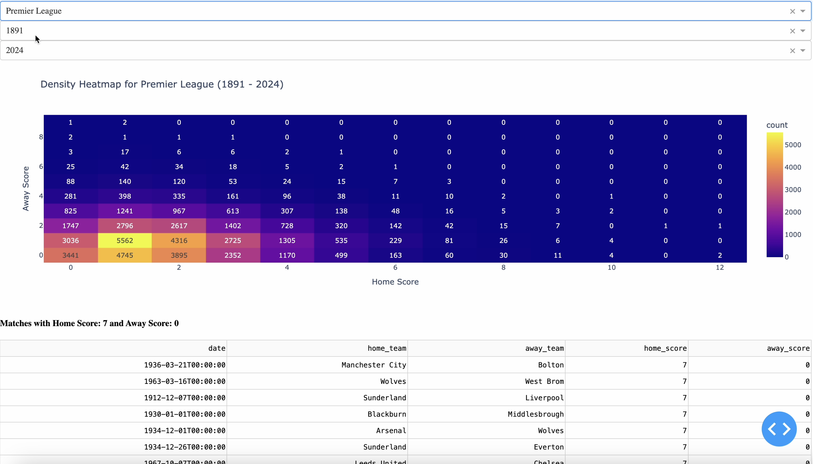

# FUTIGAMI

## Table of Contents
1. [Introduction](#introduction)
2. [Screenshots](#screenshots)
3. [Methods](#methods)
4. [Limitations](#limitations)
5. [Technologies Used](#technologies-used)
6. [File Structure](#file-structure)
7. [Future Improvements](#future-improvements)

## Introduction

**Futigami** is a dashboard that shows all the unique scorelines in Europes Top 5 futbol leagues. It is based on **Scorigami** which is the American Football version depicting all the unique scores ever recorded in a official game in the NFL.
- **Link To Scorigami Reference**: https://nflscorigami.com/

## Screenshots
Here’s a video of a local session in action (click the image below):

[](https://drive.google.com/file/d/1gtmg7aCjsh6s_Fu5fPD9SIIndJEzFOn6/view?usp=sharing)


## Methods

Using data science packages and webscraping tools I gathered information from https://fbref.com/en/ on Europes Top 5 leagues (Premier League, La Liga, Bundesliga, Ligue 1, Serie A)

## Limitations

The primary limitation of this project arises from the challenges in sourcing data, specifically related to the following issues:

- **Website Scraping Restrictions***:
The data is exclusively scraped from FBref, a comprehensive football statistics website. However, FBref actively blocks automated scraping tools, which makes it difficult to consistently gather data in a request-friendly manner. As a result, some data may be incomplete or require manual intervention to acquire, affecting the overall reliability and depth of the dataset.

- **Incomplete Historical Data**:
The historical data available on FBref for certain leagues may be limited. For example, while major leagues like the Premier League may have data going back to 1888, other leagues might only have data available from more recent years (e.g., from 1988 onwards). This limitation means that for certain leagues, we are unable to provide comprehensive statistics across all seasons.

- **Data Gaps**:
Since we rely exclusively on FBref for scraping, there might be years, matches, or statistics that are missing due to either restrictions from the website or gaps in the historical data provided by FBref itself. As a result, our analysis and visualizations might not include all the information necessary for a full historical comparison.


## Technologies Used

Python, Pandas, Plotly, Dash, BeautifulSoup, requests, re (regular expression), numpy

## File Structure
```
FUTIGAMI/               # Project root
│
├── assets/             # directory holding assets for readme
│
├── data/               # directory holding all webscraped data pertaining to each league
│   ├── bundesliga/      # subdirectory holding league data
│   ├── laliga/          # subdirectory holding league data
│   ├── ligue1/          # subdirectory holding league data
│   ├── premierleague/   # subdirectory holding league data
│   └── seriea/          # subdirectory holding league data
│ 
├── logger/             # Package for logging relevant info
│   ├── __pycache__/     # Python cache files
│   ├── __init__.py      # Init file to treat this directory as a package
│   └── Logger.py        # Handles logging of actions done, specifically reports the data being processed
│
├── dataManagement/     # Package for data handling and scraping
│   ├── __pycache__/     # Python cache files
│   ├── __init__.py      # Init file to treat this directory as a package
│   ├── LeagueStorage.py # Manages league data storage
│   └── WebScraper.py    # Handles web scraping tasks
│
├── processing/         # Package for processing data
│   ├── __pycache__/     # Python cache files
│   ├── __init__.py      # Init file for processing package
│   └── Processor.py     # Handles computations and request processing
│
├── tests/              # Package for unit tests
│   ├── __pycache__/     # Python cache files
│   ├── __init__.py      # Init file for test package
│   ├── testRequestProcessor.py  # Tests for request processing functionality
│   └── testWebscraper.py        # Tests for web scraping functionality
│
├── userInterface/      # Package for the user interface
│   ├── __pycache__/     # Python cache files
│   ├── __init__.py      # Init file for user interface package
│   └── UserInterface.py # Handles interaction with the user (e.g., front-end logic)
│
├── utility/            # Package for utility classes
│   ├── __pycache__/     # Python cache files
│   ├── __init__.py      # Init file for utility package
│   ├── LeagueHistory.py # Utility for managing league history
│   ├── Season.py        # Utility for season data
│
└── main.py             # Entry point for the application
```

## Future Improvements
### **Additional Statistics**:
I plan to introduce more advanced statistics based on the scraped data. Some key metrics I aim to publish include:

- **Goals per Season/Year**: Aggregate and display the total number of goals scored each season, with breakdowns by team, player, and matchday.
- **Top Scorers by League and Season**: Identify and showcase the top goal scorers for each league across different seasons.
- **Team Performance Metrics**: Include win/loss ratios, home vs. away performance, and streaks over time to give a deeper insight into team success.
- **Historical Comparisons**: Compare current statistics to past seasons, allowing users to visualize trends and shifts in player or team performance over the years.

### **Website Hosting for Public Access**:
A future goal is to make these statistics available on a publicly accessible website, where users can:

- **View Data Anytime**: Access statistics such as league standings, match results, and historical data through a user-friendly web interface.
- **Interactive Dashboards**: Provide dynamic visualizations like heatmaps, bar charts, and goal distribution plots, enhancing the exploration of football data.
- **Custom Queries**: Enable users to search for specific data (e.g., by team, year, or match outcomes) to tailor insights to their interests.
